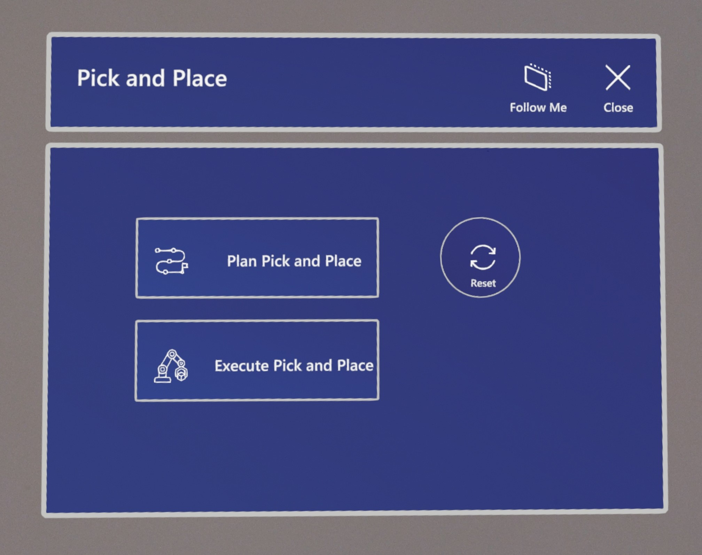

<!--
SPDX-FileCopyrightText: 2023 Microsoft Corporation, Alliander N.V.

SPDX-License-Identifier: MIT
-->

# Mixed Reality Industrial Robot Arm Control

Programming industrial robot arms can be a tedious and unintuitive process with conventional control methods, such as joysticks or 2D GUIs.

This repository contains both a Unity application and ROS packages that enable users to control a Franka Emika Research 3 robot arm using the Microsoft HoloLens 2 through a Mixed Reality experience. Besides being able to intuitively set pose targets for the robot directly in task space, there is also a demonstration for planning a simple pick and place task. Furthermore, the application utilizes the spatial awareness capabilities of the HoloLens 2 to provide information on obstacles that are in the robot workspace, enabling collision-aware motion planning of robot movements. There are three different control methods implemented into this apllication:
- Command Control: specifying a pose goal target that the arm has to move towards.
- Waypoint Control: specifying mutliple pose goal target that the arm has to move towards in the same order as placed.
- Direct Control: manual control of the robotic arm by moving either the operators hand around or using a hologram as a joystick.

This package is an adaption of the original [MRIRAC repository](https://github.com/microsoft/mixed-reality-robot-arm-control-demo/tree/main)

## Installation
### Hardware
Required hardware:
* Franka Emika Research 3 Robot arm
* Microsoft HoloLens 2
* External PC (Ubuntu 20.04)
* Printed QR codes for robot localization and object detection

#### Franka Emika Research 3 Robot
1. Mount the robot securely to a flat surface
2. Connect the power cable and the controller to the robot
3. Power on the robot, connect the ethernet cable to the external pc and go to the interface of the ip adress.
4. Unlock all the joints and activate the FCI

#### Microsoft HoloLens 2
Make sure the HoloLens 2 device is in [developer mode](https://learn.microsoft.com/en-us/windows/mixed-reality/develop/advanced-concepts/using-visual-studio?tabs=hl2#enabling-developer-mode). This is required in order to deploy the Unity application to the device.

#### External PC (Ubuntu 20.04)
As the robot arm does not have an internal computer capable of running the ROS components, a separate machine is required. This machine can be anything capable of running Ubuntu 20.04, such as an Intel NUC or a laptop. 

Make sure that unbuntu is installed with a realtime kernel. This gives the oppertunity to control the robot arm real time. Installation info can be found over [here](https://frankaemika.github.io/docs/installation_linux.html).

##### Ethernet Connection
Connect the Ethernet cable to the port on the robot and to a port on the PC. So that the PC can connect to the robot driver via the Ethernet connection, the wired connection has to be configured in the following way:

##### ROS
This project was developed using ROS Noetic. It may work with other ROS releases, but it is recommended to set up a Noetic environment on the external PC, using these [instructions](http://wiki.ros.org/noetic/Installation/Ubuntu).

#### QR Codes
Print out the [QR codes](doc/images/qr_codes/) used for robot and object localization. Generally, the detection improves with increased QR code size.

Place the QR code for robot localization on the flat surface that the robot is fixed to. When starting the application for the first time, detect the QR code by looking directly at it and the robot model should appear next to it. Move the QR code until the holographic robot model lines up with the real robot. You can then fix the QR code to the surface with tape.

The object used for the Pick and Place demo also requires a QR code to be attached, so that the HoloLens can localize it. Attach the QR code to the top of the object as centrally as possible.

### Unity setup
1. Clone this repository and open the MRIRAC_Unity folder from the Unity Hub (tested with Unity 2020.3.40f1 - we suggest using this exact Unity version, as version up/down-grades sometimes break Unity projects)
2. Check if the console gives errors after initializing.
    1. When initializing goes wrong because a certain unity package cannot be found the user can download this package from the internet and manually add this package.
    2. Duplicate or same namespace erros probably point towards a rosmessage folder that should not be in the asset directory. The same rosmessages can also be found in the MRIRAC folder and there duplication errors arise.
3. In the Unity editor, open the ROS Settings from the Robotics menu and set the ROS IP Address to the IP of the external machine connected to the robot arm.
4. Build and deploy the application to your HoloLens 2 device, following these [instructions](https://learn.microsoft.com/en-us/windows/mixed-reality/develop/unity/build-and-deploy-to-hololens) 

### ROS workspace setup
1. Create a new workspace directory that includes a src directory
2. Clone the following repositories into the same catkin_ws

```
mkdir ~/catkin_ws/src
cd ~/catkin_ws/src
git clone git@github.com:Alliander/rcdt_mrirac_fr3.git
cd rcdt_mrirac_fr3
sh install.sh ~/path/to/catkin_ws
```

3. Test the setup by running `roslaunch mrirac fr3_sim.launch`. This launches the Gazebo simulation.
 
If the setup was successful, you should be able to set a pose goal using the rviz interface and the simulated robot will move to that position once `plan and execute` is pressed.

## Usage
This section aims to provide a brief guide on how to use the core functions of the Mixed Reality experience.

### Starting the Applications
#### External PC
For the robotic operating software there are two different variants. The first option is for the use of the real robot arm while the second option only uses the simulated robot arm. The second variant is often used for testing purposes. Both variants work in combination with the hololens.

Below the commands are shown how to start the ROS nodes:

##### ROS nodes for real physical robot
```
roslaunch mrirac fr3_real.launch robot_ip:=ip_adress load_gripper:=true
```

##### ROS nodes for simulated robot
```
roslaunch mrirac fr3_sim.launch
```

#### HoloLens
From the Application Menu, start the `MRIRAC` app

### Hand Menu UI


* **Home Arm**: Send arm to 'Home' position
* **Summon Target**: Summon pose target hologram
* **Trajectory Lines**: Toggle display of trajectory lines
* **Obstacles**: Open Collision Obstacle UI
* **Show Mesh**: Toggle display of spatial awareness mesh
* **Pick and Place**: Open Pick and Place UI
* **Plan**: Try to plan a feasible path to the goal
* **Execute**: Execute the planned path
* **Extra**: Open the extra options UI

### Collision Obstacle UI


* **Sphere**: Instantiate a spherical hologram obstacle
* **Cube**: Instantiate a cubic hologram obstacle
* **Cylinder**: Instantiate a cylindrical hologram obstacle
* **Clear Obstacles**: Remove all obstacles from the planning scene
* **Toggle Spatial Obstacles**: Toggle transmission of spatial awareness mesh information

### Pick and Place UI



* **Plan Pick and Place**: Plan pick and place mission
* **Execute Pick and Place**: Execute planned pick and place mission
* **Reset**: Reset detection of pick target (removes added obstacle)

### Extra options UI


* **RRT**: Set the used planner to the RRT algorithm
* **RRT Connect**: Set the used planner to the RRT Connect algorithm
* **RRT Star**: Set the used planner to the RRT Star algorithm
* **Open gripper**: Open the grippers of the end-effector
* **Close gripper**: Close the grippers of the end-effector

## Credits
This project was developed as part of the Master Thesis for my (Koen Bessels) MSc. Robotics at the TU Delft. The project was supervised by Yke Bauke Eisema (Human Robot Interaction Lab, TU Delft) and Luc Nies (Research Center for Digital Technologies, Alliander).

This package is an adaption of the original [MRIRAC repository](https://github.com/microsoft/mixed-reality-robot-arm-control-demo/tree/main). Created by Matthew Hanlon and supervised by Eric Vollenweider from the ETH Zurich.

# Licenses
Use of the Mixed Reality Industrial Robot Arm Control source code is subject to the terms of multiple licenses, due to the inclusion of external packages.
More information is available in the [LICENSE file](LICENSE.md).

# Trademark Notice
Trademarks This project may contain trademarks or logos for projects, products, or services. Authorized use of Microsoft trademarks or logos is subject to and must follow Microsoft’s Trademark & Brand Guidelines. Use of Microsoft trademarks or logos in modified versions of this project must not cause confusion or imply Microsoft sponsorship. Any use of third-party trademarks or logos are subject to those third-party’s policies.
